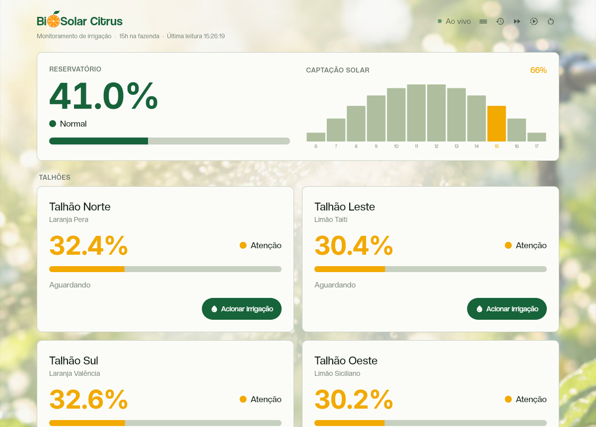
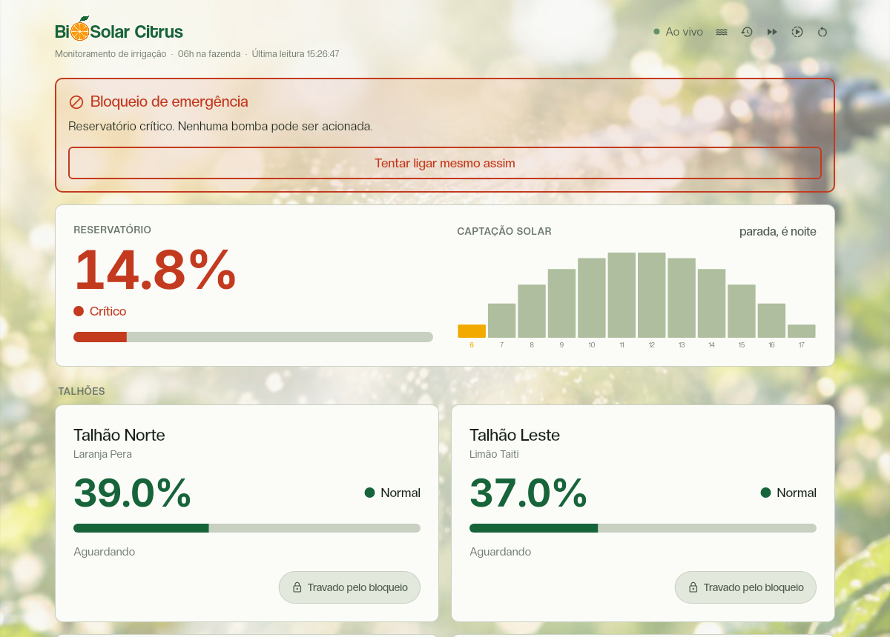
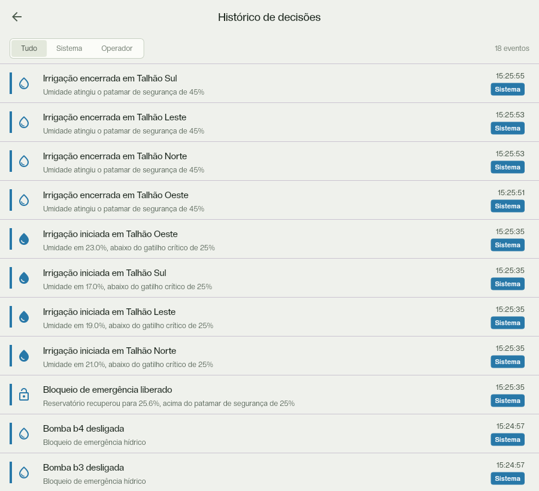
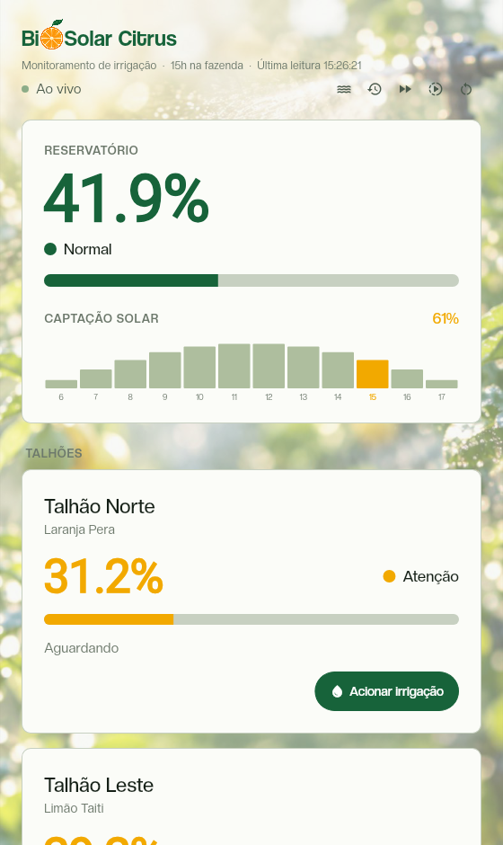

# BioSolar Citrus

Sistema de automação hidro energética para pomares de laranja e limão. Um
servidor em Dart simula a fazenda em tempo real, acompanhando a umidade de cada
talhão e o nível do reservatório, e toma sozinho todas as decisões de irrigação:
liga o aspersor quando o solo seca e executa o bloqueio de emergência
desligando todas as bombas quando a água chega ao nível crítico, recusando
inclusive os comandos manuais enquanto durar o bloqueio. O aplicativo Flutter
apenas exibe o que está acontecendo e envia comandos do operador. **Nenhuma
regra de automação mora no aplicativo.** Se o aplicativo for apagado, a fazenda
continua sendo irrigada corretamente.

HackUFRA, V JTI, Caderno de Desafio Opção 03. Autora: Paula. Universidade
Federal Rural da Amazônia, Campus Capitão Poço.

## Como rodar

Precisa do Flutter, que já traz o Dart. Desenvolvido e testado no Flutter
3.44.9 com Dart 3.12. Dois terminais:

```bash
# terminal 1, o servidor
dart pub get -C servidor && dart run servidor/bin/servidor.dart
```

```bash
# terminal 2, o aplicativo
cd app && flutter pub get && flutter run
```

Se não houver dispositivo conectado, `flutter run -d chrome` abre a versão web,
que é a mesma base de código e serve de plano de contingência.

O servidor sobe na porta 8080 e imprime o estado da fazenda a cada ciclo, então
dá para ver a simulação funcionando antes mesmo de abrir o aplicativo. Para
acelerar a simulação desde o início, use `dart run servidor/bin/servidor.dart
--demo`.

O aplicativo aponta para `http://localhost:8080` por padrão, o que serve para
web, desktop e simulador iOS. No emulador Android troque por `10.0.2.2`, e em
celular físico pelo IP da máquina na rede local:

```bash
flutter run --dart-define=SERVIDOR=http://192.168.0.10:8080
```

### Gerar o APK para instalar no celular

O endereço do servidor é decidido na compilação, então um APK genérico sai
apontando para `localhost`, que no celular é o próprio celular. Para gerar um
que funcione, dispare a rotina de integração contínua manualmente informando o
endereço:

1. Na aba **Actions** do repositório, escolha o fluxo **CI** e clique em
   **Run workflow**.
2. No campo de endereço, informe onde o servidor vai estar, por exemplo
   `http://192.168.0.10:8080`. O IP sai de `ipconfig getifaddr en0` no macOS ou
   `hostname -I` no Linux.
3. Ao terminar, o APK aparece em **Releases**, com link direto que abre no
   navegador do celular, e também como artefato do run.

O aplicativo só mostra telemetria se alcançar esse endereço pela rede. Com o
servidor rodando no notebook, o caminho mais confiável é **ligar o roteador do
celular e conectar o notebook nele**: rede de evento costuma isolar os aparelhos
entre si, e aí nenhum endereço funciona.

## Telas

Painel em operação normal. As faixas de alerta aparecem por cor e por texto, o
gráfico mostra a produção solar prevista ao longo do dia simulado com a hora
atual destacada, e o ponto ao lado do título diz se a telemetria está chegando
pelo canal em tempo real ou pela consulta de reserva:



Bloqueio de emergência ativo. A tela inteira muda de temperatura com o estado do
reservatório, os botões ficam travados com cadeado e o "Tentar ligar mesmo
assim" existe para provar, na frente da banca, que a recusa vem do servidor e
não da interface:



Histórico de decisões. O bloqueio em vermelho aparece no meio da parede azul
das irrigações automáticas, e cada linha diz se a ação partiu do sistema ou do
operador:



No celular, que é onde o aplicativo de fato vai ser usado:



O painel se ajusta à largura disponível: os talhões ficam em duas colunas a
partir de 700 pixels e em uma só abaixo disso, e acima de 1100 o conteúdo para
de crescer e se centraliza, com o fundo cobrindo a janela inteira.

### Tipografia

Três famílias, cada uma com um trabalho:

| Fonte | Onde | Por quê |
| --- | --- | --- |
| **Coolvetica** | só no nome do aplicativo | marca, aparece uma vez por tela |
| **Creato Display** | todo o resto da interface | texto de leitura, quatro pesos |
| **Inter** | só nos valores numéricos | **figuras tabulares** |

A Inter fica porque a Creato Display não tem dígitos de largura fixa nem o
recurso `tabularFigures`. Sem isso, o número grande muda de largura a cada
atualização e dança horizontalmente na tela, que é exatamente o que faz um
painel de telemetria parecer instável. Os arquivos das duas primeiras vivem em
`app/assets/fontes`, para o aplicativo não depender de rede.

### Fundo

Uma foto de irrigação em pomar entra como textura, em `app/assets/imagens`,
desenhada cobrindo a tela e fixa, fora da área rolável, então não acompanha a
rolagem. Ela já vem desfocada da origem, o que dispensa filtro em tempo de
execução: não há desfoque calculado por quadro em lugar nenhum.

Por cima vai um véu da cor de fundo do tema, com a opacidade em
`_opacidadeDoVeu`. Os cartões ficam por cima disso, então o contraste dos
números não depende do que está atrás deles.

A opacidade do véu foi escolhida medindo contraste, não a olho, no pior ponto de
fundo atrás do texto terciário, que é o de menor contraste da tela e portanto o
primeiro a sofrer. Com a composição atual, a linha de contexto fica em 4,42 e o
rótulo TALHÕES em 4,52, ambos acima do mínimo de 4,5 do WCAG AA para o rótulo e
muito perto dele na linha de contexto. Baixar o véu derruba esses números
primeiro, então é por eles que se decide o limite.

### Peso dos recursos

Fonte e imagem entram no aplicativo instalado, então valem a mesma atenção que
código. As imagens são servidas no tamanho em que aparecem, e não no tamanho em
que saíram da câmera ou do editor:

| Recurso | Tamanho |
| --- | --- |
| `fundo-irrigacao.jpg` | 118 KB, 788 x 1400 |
| `marca-laranja.png` | 118 KB, PNG por causa da transparência |
| Fontes | 240 KB, cinco arquivos |

O fundo é JPEG porque é foto e fica sob um véu; a marca continua PNG porque
precisa de fundo transparente. Juntos, os recursos somam menos de meio megabyte.

### Por que fundo claro### Por que fundo claro

Este aplicativo é para o produtor usar no campo, no sol, de relance e com uma
mão. Isso manda fundo claro, contraste alto, texto grande, alvo de toque grande
e pouca informação por tela. Tema escuro de sala de controle é bonito no
monitor e ilegível debaixo do sol, então as cores de estado são escuras o
bastante para sobreviver à luz direta, o número de cada talhão tem 52 pixels e
o botão de acionamento ocupa a largura do cartão com 56 pixels de altura, bem
acima dos 48 recomendados para toque.

## Regras de negócio

Todas as decisões vivem em [`servidor/lib/dominio/regras/regras.dart`](servidor/lib/dominio/regras/regras.dart),
como funções puras que recebem o estado e devolvem o estado seguinte. Cada
função leva no topo o código da regra que implementa.

A coluna de origem separa o que o caderno exige do que foi projetado aqui. Onde
o caderno define o comportamento mas não o número, a linha aparece como caderno
com calibragem própria, porque o valor foi escolhido para que a demonstração
funcione e não está no enunciado.

| Código | Regra | Limiar ou detalhe | Origem |
| --- | --- | --- | --- |
| RN01 | Queda natural da umidade | 1,2 ponto por ciclo em talhão sem irrigação | Caderno, taxa calibrada aqui |
| RN02 | Recuperação por irrigação | 3,0 pontos por ciclo com aspersor ligado | Caderno, taxa calibrada aqui |
| RN03 | Consumo do reservatório | 0,40 por bomba ligada por ciclo | Caderno, taxa calibrada aqui |
| RN04 | Irrigação crítica automática | umidade abaixo de 25% aciona o aspersor | Caderno |
| RN05 | Encerramento da irrigação automática | umidade de volta a 45%, acima do gatilho para criar histerese | Caderno, patamar e histerese decididos aqui |
| RN06 | Bloqueio de emergência | reservatório abaixo de 15% desliga todas as bombas | Caderno |
| RN07 | Precedência | o bloqueio tem prioridade absoluta sobre a irrigação crítica | Decisão de projeto |
| RN08 | Recusa de comando manual | durante o bloqueio o servidor responde 409 com o motivo | Decisão de projeto |
| RN09 | Liberação do bloqueio | reservatório de volta a 25% | Decisão de projeto |
| RN10 | Faixas de alerta | verde, amarelo e vermelho, com rótulo escrito junto da cor | Caderno, fronteiras decididas aqui |
| RN11 | Origem do evento | todo evento identifica se foi operador ou sistema | Decisão de projeto |
| RN12 | Captação solar | vazão que acompanha a curva do sol, nula à noite, no pico valendo 1,50 contra os 1,60 que quatro bombas consomem | Decisão de projeto |
| RN13 | Chuva manual | enquanto ligada, o solo ganha 1,5 por ciclo sem aspersor e o reservatório recebe 1,2 por ciclo até o teto de 70% | Decisão de projeto |

O caderno define os dois limiares que importam, 25% de umidade e 15% de
reservatório. Todo o resto, as taxas de queda e recuperação, o consumo por
bomba, o patamar de histerese e as fronteiras de cor, é calibragem feita para
que os cenários aconteçam em tempo de demonstração.

### RN12, por que existe captação solar se o caderno não pediu

O caderno define o consumo do reservatório, mas não diz o que o reabastece. Sem
reposição, depois do primeiro bloqueio o nível ficaria parado para sempre e a
RN09 nunca aconteceria fora dos testes. A captação solar resolve isso e faz o
nome do projeto significar alguma coisa.

A calibragem dela é o coração do comportamento do sistema, e são dois números em
tensão. No pico do dia a captação vale **1,50**, contra os **1,60** que as quatro
bombas consomem juntas: irrigar tudo ao mesmo tempo derruba o reservatório mesmo
ao meio-dia, e é por isso que o bloqueio continua sendo alcançável. Mas a
irrigação é intermitente e a captação só falta à noite, então **na média do dia
ela cobre a manutenção dos quatro talhões** e a fazenda se sustenta.

É essa diferença que separa escassez de colapso. Com a captação abaixo da
manutenção, o sistema entra num estado absorvente: depois do primeiro bloqueio a
janela de irrigação fica curta demais para tirar qualquer talhão do crítico, e o
painel nunca mais sai do vermelho. O **T13** existe para provar que a calibragem
está do lado certo dessa fronteira.

### RN13, modo de chuva

Serve para demonstrar o sistema sob outra condição sem mexer em nenhuma regra.
Enquanto a chuva está ligada, o solo de todos os talhões sobe 1,5 por ciclo em
vez de secar, e o reservatório recebe 1,2 por ciclo **até o teto de 70%**, para
que alguns segundos de chuva não encham a fazenda e esvaziem o cenário.

O que não muda é o mais importante. A irrigação crítica abaixo de 25% continua
valendo durante a chuva, ela apenas não costuma disparar porque o solo não seca;
se ainda assim um talhão cruzar o gatilho, o aspersor liga. O bloqueio de
emergência e a precedência da RN07 seguem intactos, e se a chuva levar o
reservatório até o patamar da RN09 durante um bloqueio, o bloqueio é liberado
pela regra de sempre, sem nenhum caminho especial. Medido em execução: com o
reservatório em 14,4% e bloqueado, a chuva o levou aos 26,6% e a RN09 liberou
sozinha em 16 segundos.

Início e fim da chuva entram no histórico com origem de operador, porque é
comando de operador.

### Contrato da API

| Rota | Para que serve |
| --- | --- |
| `GET /telemetria` | Estado completo da fazenda |
| `POST /bombas/acionar` | `{"bombaId":"b1","ligar":true}`. Responde **409** durante o bloqueio, com o motivo |
| `GET /eventos?limite=&deslocamento=` | Histórico de decisões, paginado |
| `POST /simulacao/velocidade` | `{"acelerada":true}` liga o modo demonstração |
| `POST /simulacao/chuva` | `{"chovendo":true}` liga o modo chuva |
| `POST /simulacao/reset` | Devolve a simulação ao estado inicial |
| `WS /stream` | Empurra a telemetria a cada ciclo |

## Arquitetura

```
   +--------------------------+
   |   APLICATIVO FLUTTER     |
   |   telas e comandos       |
   +------------+-------------+
                |
         HTTP e WebSocket
                |
   +------------v-------------+
   |    SERVIDOR DART         |
   |  rotas e transporte      |
   +------------+-------------+
                |
   +------------v-------------+
   |   MOTOR DE SIMULACAO     |
   |   tick periodico         |
   +------------+-------------+
                |
   +------------v-------------+
   |   MOTOR DE REGRAS        |
   |   RN01 ate RN12          |
   +------------+-------------+
                |
   +------------v-------------+
   |   ESTADO EM MEMORIA      |
   |   talhoes, reservatorio, |
   |   bombas e eventos       |
   +--------------------------+
```

**Nenhuma decisão acontece no aplicativo.** Ele desenha o que recebe e envia o
que o operador pede, e até a cor de cada indicador vem calculada do servidor. A
prova operacional disso é o botão "Tentar mesmo assim" do painel bloqueado: ele
passa por cima da trava da interface e o servidor recusa mesmo assim, com 409.

```
biosolar_citrus/
|
+-- servidor/
|   +-- bin/servidor.dart            ponto de entrada, simulacao e rotas
|   +-- lib/dominio/regras/          <-- TODAS as decisoes moram aqui
|   +-- lib/dominio/                 contrato do repositorio
|   +-- lib/aplicacao/               servico de simulacao, controla o tempo
|   +-- lib/infraestrutura/          rotas HTTP, WebSocket, estado em memoria
|   +-- test/                        T01 a T12
|
+-- app/
|   +-- lib/nucleo/                  injecao de dependencias, tema e falhas
|   +-- lib/funcionalidades/         monitoramento e eventos, cada um com
|   |                                dominio, dados e apresentacao
|   +-- test/                        testes de bloc
|
+-- compartilhado/
    +-- lib/modelos.dart             contratos usados pelos dois lados
```

A pasta `servidor/lib/dominio/regras/` é a mais importante do repositório. Ela
contém apenas decisões, sem rede e sem interface, e é a primeira coisa a abrir
quando a pergunta for onde está determinada exigência do caderno.

O aplicativo segue a mesma separação por camadas dentro de cada funcionalidade.
Dois detalhes que valem apontar:

- **Leitura e comando são contratos separados.** `LeitorTelemetria`,
  `LeitorEventos` e `EmissorComando` são interfaces distintas, então uma tela
  que só observa não depende de métodos de escrita. O painel não sabe ler
  histórico e a tela de histórico não sabe ler telemetria.
- **A origem do dado fica escondida da tela.** `CanalFazenda` entrega leituras
  vindas do WebSocket ou da consulta REST de reserva, e quem consome não sabe
  nem precisa saber por qual caminho elas chegaram. Foi isso que permitiu trocar
  polling por tempo real sem mudar uma linha de tela.

## Testes

Dezoito testes no total, executados a cada envio pela rotina de integração
contínua em [`.github/workflows/ci.yaml`](.github/workflows/ci.yaml). As regras
são funções puras, então os testes mais importantes do projeto são também os
mais simples de escrever, sem nenhum objeto falso e sem subir servidor.

Cada linha em um subshell, para poder colar as duas de uma vez a partir da raiz
do repositório:

```bash
(cd servidor && dart test)
```

```bash
(cd app && flutter test)
```

| Teste | O que verifica | Regra |
| --- | --- | --- |
| T01 | A umidade cai a cada ciclo em talhão sem irrigação | RN01 |
| T02 | A umidade sobe a cada ciclo com o aspersor ligado | RN02 |
| T03 | Consumo proporcional às bombas, contra a captação solar | RN03 |
| T04 | A irrigação aciona sozinha ao cruzar o limite crítico | RN04 |
| T05 | A irrigação automática só encerra no patamar de segurança | RN05 |
| T06 | O bloqueio desliga todas as bombas ao cruzar o limite | RN06 |
| T07 | **Reservatório crítico e talhão seco ao mesmo tempo, nenhuma bomba liga** | RN07 |
| T08 | O comando manual é recusado no bloqueio e devolve o motivo | RN08 |
| T09 | O bloqueio só é liberado no patamar de segurança | RN09 |
| T10 | Todo evento identifica corretamente a origem | RN11 |
| T11 | A captação solar segue a curva do sol e nunca compensa a irrigação plena | RN12 |
| T12 | A irrigação manual acima do patamar alerta sem desligar, e alerta uma vez só | RN05 |
| T13 | **Na média do dia a captação cobre a manutenção dos talhões** | RN12 |
| T14 | Durante a chuva o solo sobe sem bomba, e a irrigação crítica continua valendo | RN13 |

O **T07 é o mais valioso da suíte**, porque documenta a precedência entre as duas
regras críticas do desafio, que é o ponto onde a maioria das implementações
falha. O T12 roda duzentos ciclos até o solo saturar em 100%, porque é ali que
um teste de cruzamento ingênuo vira condição permanente e o alerta viraria spam.

O **T13 guarda a fronteira entre escassez e colapso**. Ele compara a captação
média do dia com o consumo de manutenção dos quatro talhões, e falha se a
calibragem cair para o lado errado. Sem ele, mudar `consumoPorBombaPorTick` ou
`recargaSolarPico` pode devolver o sistema ao estado em que nenhum talhão sai do
crítico depois do primeiro bloqueio, e nada nos outros testes acusaria.

Os quatro testes de bloc cobrem o que a interface promete: telemetria recebida
vira estado carregado, a perda de contato não apaga a última leitura conhecida,
a leitura seguinte reconecta a tela sozinha, e a recusa do servidor chega à
interface com a mensagem original.

## Balanço hídrico

A fazenda opera no limite, e de propósito. A captação solar cobre a manutenção
dos talhões por pouco, mas não cobre irrigação plena simultânea, e é essa margem
estreita que faz o sistema ter os dois comportamentos que o caderno pede: ele
chega ao bloqueio de emergência e também se recupera dele.

### Os números, medidos

Cada talhão precisa de bomba durante 28,6% do tempo para se manter na faixa
segura, porque a umidade sobe 3,0 por ciclo irrigando e cai 1,2 por ciclo sem
irrigação, então `1,2 / (3,0 + 1,2)`. Com quatro talhões, isso dá 1,14 bombas
ligadas em média, de forma contínua.

| | Cálculo | Pontos percentuais por dia |
| --- | --- | --- |
| Captação solar | `1,50 x média do seno x 48 ciclos de sol` | **45,8** |
| Consumo de manutenção | `1,14 bombas x 0,40 x 96 ciclos` | **43,9** |
| Saldo | | **+2,0** |

A folga é de 4%. No pico do dia, porém, quatro bombas ligadas consomem 1,60
contra os 1,50 da captação, então **irrigação plena simultânea derruba o
reservatório mesmo ao meio-dia**. O sistema é sustentável em regime e vulnerável
em pico, que é exatamente o que torna o bloqueio uma proteção necessária em vez
de um detalhe decorativo.

### O cenário, observado em execução

O estado inicial coloca a fazenda em estiagem de madrugada: reservatório em 26%,
os quatro talhões abaixo ou rente ao gatilho, e o relógio às 3h, quando não há
sol nenhum para repor água. Medido em velocidade normal, a partir do reset:

| Tempo real | Hora na fazenda | O que acontece |
| --- | --- | --- |
| 0s | 03h | Reservatório 26%, talhões entre 20% e 26% |
| ~4s | 04h | As quatro bombas ligam sozinhas (RN04) |
| **15s** | 05h | **Bloqueio de emergência** aos 14,8% (RN06) |
| **53s** | 09h | **Liberação** aos 25,6%, pela captação solar (RN09, RN12) |
| daí em diante | | Reservatório entre 23% e 44%, talhões ciclando entre 20% e 47% |

Os três cenários da apresentação cabem em **53 segundos sem acelerar nada**, e
depois o sistema se mantém estável sozinho. O bloqueio acontece de madrugada,
quando a captação é zero, e quem traz a fazenda de volta é o amanhecer.

### Dimensionamento

Uma fazenda real não é calibrada assim por acaso. Dimensionar reservatório e
captação para a demanda de um pomar é decisão de projeto agronômico, não de
software: envolve área irrigada, cultura, evapotranspiração local e orçamento de
painel solar. O que o sistema de automação faz diante do dimensionamento que
recebeu é irrigar enquanto há água, travar tudo quando não há, e voltar a operar
quando a fonte se recupera.

### Irrigação sem priorização

O sistema trata todos os talhões com igualdade, então quando o bloqueio é
liberado todos os que estiverem abaixo do gatilho são irrigados ao mesmo tempo,
o que é justamente o pico de consumo que o reservatório não sustenta. Uma regra
de priorização por criticidade, irrigando apenas o talhão mais seco abaixo de um
patamar de conforto, suavizaria essa queda e entraria como mais uma função no
mesmo módulo de regras, sem tocar em transporte nem em interface.

Vale registrar o que foi medido a respeito: a priorização **não** substitui o
dimensionamento. Numa calibragem em que a captação fica abaixo da manutenção,
simular uma bomba por vez não tira os talhões do crítico, porque enquanto um
sobe 3,0 os outros três caem 1,2 cada. A priorização melhora o pico; quem
resolve o regime é o balanço da tabela acima.

### Pausa noturna da captação

À noite a captação solar é zero e o reservatório fica parado até o amanhecer
simulado. Não é defeito, é o comportamento esperado de um sistema movido a sol,
e o painel diz isso com todas as letras. Se a demonstração cair num horário
simulado ruim, o botão de reiniciar cenário devolve a fazenda para a manhã.

### Sem persistência

O estado vive na memória do servidor e o histórico tem teto de 500 eventos,
descartando os mais antigos. Reiniciar o servidor zera a simulação. É uma
decisão alinhada ao caderno, que proíbe persistência local e não exige banco de
dados.

## Evolução futura

Em uma versão com pomar real, a camada de simulação daria lugar à leitura de
sensores de umidade de solo e boia de nível, e as bombas passariam a ser
acionadas por relé, sem que o motor de regras precisasse mudar, porque ele já
recebe estado e devolve decisão sem saber de onde o estado veio. Junto com isso
entrariam a priorização por criticidade descrita acima, o balanço energético
solar completo, indicando as janelas em que irrigar sai mais barato, e um
histórico persistente para análise de safra, que hoje não existe apenas porque
a restrição de persistência do desafio não permite.
